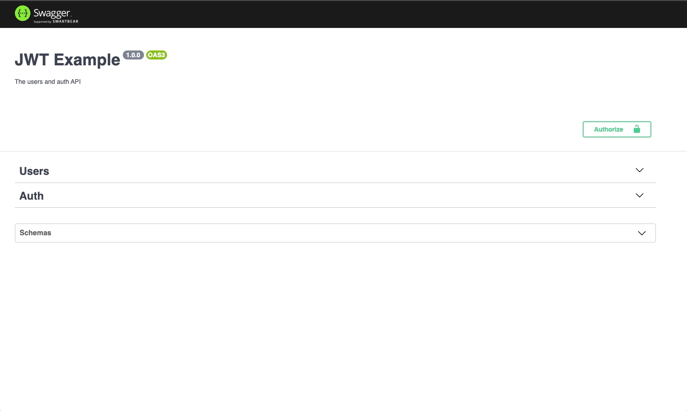

### Auth JWT (Swagger)

#### Gif swagger



#### Step by step tutorial

```console
npm i @nestjs/typeorm typeorm mariadb mysql
```

> To work with mysql/mariadb

```console
npm i @nestjs/config
```

> To use .env easily

```console
npm i class-validator class-transformer
```

> To validate and transform data of requests

```console
npm i bcrypt
```

> To encrypt password

```console
openssl rand -base64 32
```

> To generate a key to use with JWT_SECRET_KEY in .env